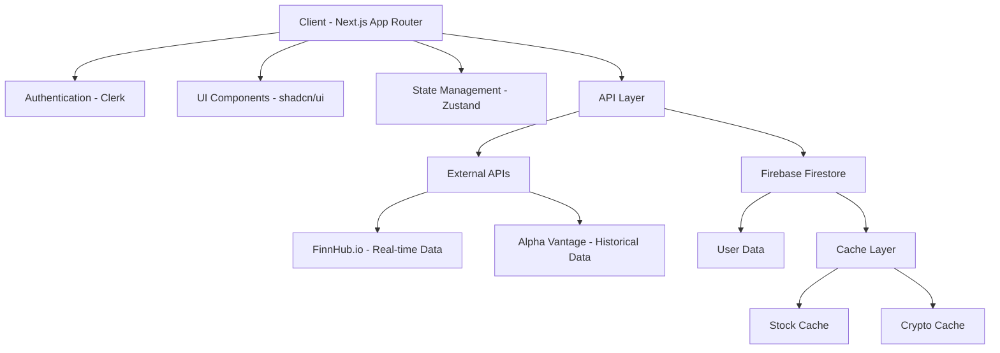

# Design Document

## Overview

Foresight is a comprehensive financial planning application built with Next.js 14+ using the App Router, TypeScript, Firebase, Clerk authentication, and shadcn/ui components. The application follows a philosophy of empowering users to make informed financial decisions through visualization, planning, and tracking of their financial health.

The design emphasizes performance, user experience, and maintainability while supporting multi-currency operations, regional loan compliance, and intelligent caching for investment data.

## Architecture

### High-Level Architecture



### Technology Stack

- **Frontend**: Next.js 14+ with App Router, TypeScript, Tailwind CSS
- **UI Components**: shadcn/ui with Radix UI primitives
- **Authentication**: Clerk with user management and billing
- **Database**: Firebase Firestore with real-time capabilities
- **State Management**: Zustand for global state, React hooks for local state
- **Animations**: Framer Motion for professional animations
- **Financial APIs**: FinnHub.io (real-time), Alpha Vantage (historical)
- **Deployment**: Vercel with optimized builds

## Components and Interfaces

### Core Component Structure

Following Next.js App Router best practices with feature-based organization:

```
src/
├── app/                    # App Router pages and layouts
│   ├── (auth)/            # Authentication routes
│   ├── dashboard/         # Main dashboard
│   ├── investments/       # Investment portfolio
│   ├── budgets/          # Budget management
│   ├── income/           # Income sources
│   ├── expenses/         # Expense tracking
│   ├── loans/            # Loan management
│   ├── funds/            # Goals, Pots, Saving funds
│   ├── insights/         # Analytics and insights
│   └── settings/         # User settings
├── components/
│   ├── ui/               # Atomic shadcn/ui components
│   └── shared/           # Complex reusable components
├── lib/                  # Utilities and configurations
├── providers/            # Context providers
└── types/               # TypeScript definitions
```
#
## Navigation Architecture

#### Sidebar Navigation System
- **Primary Navigation**: Collapsible sidebar using shadcn sidebar-08 component
- **Persistent State**: Cookie-based state management with `sidebar_state` cookie
- **Dual Navigation Pattern**: Sidebar + tab-based navigation for detailed sections
- **Shared Configuration**: Centralized navigation config imported by breadcrumb and sidebar components

#### Navigation Structure
```typescript
interface NavigationConfig {
  main: {
    dashboard: { label: string; href: string; icon: string }
    investments: { 
      label: string; 
      href: string; 
      icon: string;
      subItems: ['stocks', 'bonds', 'mutual-funds', 'real-estate', 'crypto', 'other']
    }
    budgets: {
      label: string;
      href: string;
      icon: string;
      subItems: ['income-splitting', 'buckets', 'manage']
    }
    // ... other sections
  }
}
```

## Data Models

### Core Data Structures

#### User Profile
```typescript
interface UserProfile {
  id: string;
  clerkId: string;
  primaryCurrency: string;
  preferences: {
    theme: 'light' | 'dark' | 'system';
    language: string;
    timezone: string;
  };
  createdAt: Date;
  updatedAt: Date;
}
```

#### Multi-Currency Transaction
```typescript
interface Transaction {
  id: string;
  userId: string;
  amount: number;
  currency: string;
  convertedAmount?: number; // In primary currency
  exchangeRate?: number;
  category: string;
  subcategory?: string;
  description: string;
  date: Date;
  type: 'income' | 'expense' | 'transfer' | 'investment';
  metadata?: Record<string, any>;
}
```

#### Budget System
```typescript
interface BudgetAllocation {
  userId: string;
  totalIncome: number;
  currency: string;
  categories: {
    essentials: { percentage: 50; amount: number };
    lifestyle: { percentage: 20; amount: number };
    savingsFuture: { percentage: 20; amount: number };
    sinkingFund: { percentage: 10; amount: number };
    unallocated: { amount: number };
    misc: { amount: number };
  };
  lastUpdated: Date;
}

interface Bucket {
  id: string;
  userId: string;
  name: string;
  category: 'essentials' | 'lifestyle' | 'savingsFuture' | 'sinkingFund';
  targetAmount: number;
  currentAmount: number;
  currency: string;
  renewalRate: 'daily' | 'every2days' | 'weekly' | 'biweekly' | 'monthly' | 'bimonthly' | 'yearly' | 'biyearly' | 'quarterly';
  nextRenewal: Date;
  isActive: boolean;
}
```#### 
Investment Portfolio with Caching
```typescript
interface Investment {
  id: string;
  userId: string;
  symbol: string;
  type: 'stock' | 'bond' | 'mutual-fund' | 'real-estate' | 'crypto' | 'other';
  quantity: number;
  purchasePrice: number;
  purchaseCurrency: string;
  purchaseDate: Date;
  lastSyncedPrice: number;
  lastSyncTimestamp: Date;
  currentValue?: number; // Calculated field
}

interface PriceCache {
  symbol: string;
  type: 'stock' | 'crypto';
  price: number;
  currency: string;
  lastUpdated: Date;
  source: 'finnhub' | 'alphavantage';
}
```

#### Loan Management with Regional Compliance
```typescript
interface Loan {
  id: string;
  userId: string;
  type: 'home' | 'car' | 'personal' | 'other';
  principal: number;
  interestRate: number;
  termMonths: number;
  startDate: Date;
  currency: string;
  region: 'india' | 'us' | 'eu';
  rateType: 'fixed' | 'floating';
  
  // Regional specific fields
  rbiCompliance?: {
    isRLLR: boolean;
    benchmarkRate: number;
    spread: number;
    creditRiskPremium: number;
  };
  
  usCompliance?: {
    apr: number;
    isARM: boolean;
    armDetails?: {
      initialRate: number;
      margin: number;
      adjustmentCaps: {
        initial: number;
        periodic: number;
        lifetime: number;
      };
    };
  };
  
  euCompliance?: {
    aprc: number;
    hasWithdrawalPeriod: boolean;
    prepaymentCompensation?: number;
  };
}

interface AmortizationSchedule {
  loanId: string;
  payments: Array<{
    paymentNumber: number;
    openingBalance: number;
    totalPayment: number;
    interestComponent: number;
    principalComponent: number;
    closingBalance: number;
    paymentDate: Date;
  }>;
  totalInterest: number;
  totalPayments: number;
}
```

#### Funds Management (Pots and Goals)
```typescript
interface Pot {
  id: string;
  userId: string;
  name: string;
  description: string;
  targetAmount: number;
  currentAmount: number;
  currency: string;
  linkedCategories: Array<'essentials' | 'lifestyle' | 'savingsFuture' | 'sinkingFund' | 'unallocated'>;
  sourceAllocations: Array<{
    categoryId: string;
    amount: number;
    date: Date;
  }>;
  goalType: 'vacation' | 'house-downpayment' | 'laptop' | 'other';
  targetDate?: Date;
  isCompleted: boolean;
  createdAt: Date;
}

interface SavingFund {
  id: string;
  userId: string;
  type: '401k' | 'education' | 'retirement' | 'other';
  name: string;
  targetAmount: number;
  currentAmount: number;
  currency: string;
  contributionSchedule: {
    frequency: 'weekly' | 'biweekly' | 'monthly' | 'quarterly' | 'yearly';
    amount: number;
    nextContribution: Date;
  };
  targetDate: Date;
  riskProfile: 'conservative' | 'moderate' | 'aggressive';
}
```## Er
ror Handling

### Client-Side Error Handling
```typescript
// Global error boundary for React components
class GlobalErrorBoundary extends Component {
  // Handle component errors gracefully
}

// API error handling with retry logic
interface ApiError {
  code: string;
  message: string;
  statusCode: number;
  retryable: boolean;
}

// Financial calculation error handling
class FinancialCalculationError extends Error {
  constructor(
    message: string,
    public calculationType: string,
    public inputData: any
  ) {
    super(message);
  }
}
```

### Server-Side Error Handling
```typescript
// Firebase error handling
const handleFirebaseError = (error: FirebaseError) => {
  switch (error.code) {
    case 'permission-denied':
      return { message: 'Access denied', statusCode: 403 };
    case 'not-found':
      return { message: 'Resource not found', statusCode: 404 };
    default:
      return { message: 'Internal server error', statusCode: 500 };
  }
};

// External API error handling with fallback
const handleExternalApiError = async (error: any, fallbackFn?: Function) => {
  if (error.response?.status === 429) {
    // Rate limit - use cache
    return await getCachedData();
  }
  
  if (fallbackFn) {
    return await fallbackFn();
  }
  
  throw new ApiError('External service unavailable', error.message, 503, true);
};
```

### Currency Conversion Error Handling
```typescript
interface CurrencyConversionError {
  fromCurrency: string;
  toCurrency: string;
  amount: number;
  errorType: 'rate-unavailable' | 'invalid-currency' | 'api-error';
  fallbackRate?: number;
}

const handleCurrencyError = (error: CurrencyConversionError) => {
  // Use cached rates or default to 1:1 with warning
  return {
    convertedAmount: error.fallbackRate ? error.amount * error.fallbackRate : error.amount,
    warning: `Currency conversion failed, using ${error.fallbackRate ? 'cached' : 'default'} rate`
  };
};
```

## Testing Strategy

### Unit Testing
- **Components**: Test all UI components with React Testing Library
- **Utilities**: Test financial calculation functions with edge cases
- **Hooks**: Test custom hooks with various scenarios
- **API Functions**: Mock external services and test error handling

### Integration Testing
- **Authentication Flow**: Test Clerk integration end-to-end
- **Database Operations**: Test Firebase operations with test database
- **External APIs**: Test with mock responses and error scenarios
- **Currency Conversion**: Test multi-currency calculations

### End-to-End Testing
- **User Journeys**: Test complete workflows (budget creation, loan management)
- **Cross-Browser**: Ensure compatibility across modern browsers
- **Performance**: Test loading times and animation smoothness
- **Accessibility**: Test keyboard navigation and screen reader compatibility

### Financial Calculation Testing
```typescript
describe('Loan Amortization', () => {
  test('should calculate EMI correctly for Indian loans', () => {
    const loan = {
      principal: 1000000,
      interestRate: 8.5,
      termMonths: 240,
      region: 'india'
    };
    
    const emi = calculateEMI(loan);
    expect(emi).toBeCloseTo(8678.83, 2);
  });
  
  test('should handle prepayment scenarios', () => {
    // Test both tenure reduction and EMI reduction options
  });
  
  test('should apply regional regulations correctly', () => {
    // Test RBI, TILA, and EU compliance
  });
});
```### Perf
ormance Testing
- **Cache Efficiency**: Test investment data caching performance
- **Database Queries**: Optimize Firestore queries and indexing
- **Bundle Size**: Monitor and optimize JavaScript bundle sizes
- **Core Web Vitals**: Ensure excellent LCP, FID, and CLS scores

## Performance Optimizations

### Next.js Optimizations
```typescript
// Dynamic imports for large components
const HeavyChart = dynamic(() => import('@/components/charts/heavy-chart'), {
  loading: () => <ChartSkeleton />,
  ssr: false
});

// Image optimization
import Image from 'next/image';
<Image
  src="/financial-chart.png"
  alt="Financial Chart"
  width={800}
  height={400}
  priority={isAboveFold}
/>

// Font optimization
import { Inter } from 'next/font/google';
const inter = Inter({ subsets: ['latin'] });
```

### Caching Strategy
```typescript
// Investment data caching
interface CacheStrategy {
  stocks: {
    updateTrigger: 'user-request';
    sharedCache: true;
    ttl: '4-minutes-since-last-update';
  };
  crypto: {
    updateTrigger: 'user-request';
    sharedCache: true;
    ttl: '4-minutes-since-last-update';
  };
  exchangeRates: {
    updateTrigger: 'scheduled';
    frequency: 'hourly';
    fallback: 'cached-rates';
  };
}

// Cache implementation
class InvestmentCache {
  async updateUserPortfolio(userId: string) {
    const userInvestments = await getUserInvestments(userId);
    const symbols = userInvestments.map(inv => inv.symbol);
    
    // Update cache for all symbols in user's portfolio
    await this.updateCacheForSymbols(symbols);
    
    // Update user's last sync timestamp
    await this.updateUserSyncTimestamp(userId);
  }
  
  async getCachedPrices(symbols: string[]) {
    // Return cached prices if available and fresh
    // Otherwise fetch from external APIs
  }
}
```

### Database Optimization
```typescript
// Firestore indexing strategy
interface FirestoreIndexes {
  transactions: ['userId', 'date', 'type'];
  investments: ['userId', 'type', 'lastSyncTimestamp'];
  loans: ['userId', 'region', 'type'];
  budgets: ['userId', 'lastUpdated'];
}

// Pagination for large datasets
const getPaginatedTransactions = async (
  userId: string,
  limit: number = 50,
  startAfter?: DocumentSnapshot
) => {
  let query = db
    .collection('transactions')
    .where('userId', '==', userId)
    .orderBy('date', 'desc')
    .limit(limit);
    
  if (startAfter) {
    query = query.startAfter(startAfter);
  }
  
  return await query.get();
};
```

## Security Considerations

### Authentication & Authorization
- **Clerk Integration**: Secure user authentication with session management
- **Route Protection**: Server-side route protection for sensitive data
- **API Security**: Validate user permissions for all API endpoints
- **Data Isolation**: Ensure users can only access their own financial data

### Data Protection
```typescript
// Data validation schemas
const TransactionSchema = z.object({
  amount: z.number().positive(),
  currency: z.string().length(3),
  category: z.enum(['income', 'expense', 'transfer', 'investment']),
  userId: z.string().uuid(),
  date: z.date()
});

// Sanitize financial data
const sanitizeFinancialInput = (input: any) => {
  return {
    ...input,
    amount: Math.round(input.amount * 100) / 100, // Prevent precision issues
    description: sanitizeHtml(input.description)
  };
};
```

### External API Security
- **API Key Management**: Secure storage of external API keys
- **Rate Limiting**: Implement client-side rate limiting for external APIs
- **Data Validation**: Validate all external API responses
- **Fallback Mechanisms**: Graceful degradation when external services fail

This comprehensive design document provides the foundation for implementing the Foresight financial planning application with all the specified requirements, ensuring scalability, maintainability, and excellent user experience.